# Ecommerce Website

Welcome to our E-Commerce Platform, your one-stop shop for all your shopping needs! We're thrilled to have you here and can't wait for you to explore our wide range of products. Whether you're looking for the latest tech gadgets, stylish apparel, or everyday essentials, we've got you covered.

## Description

The E-Commerce Platform is a web application designed to facilitate online shopping. It provides features for product listings, user authentication, shopping cart management, order processing, and more.

## Features

- Login / Logout
- Product Listing
- Add To Cart
- User Name

## Technologies Used

- **Frontend**: HTML, CSS, JavaScript, React
- **Backend**: Node.js, Express.js
- **Database**: MongoDB (or your choice of database)
- **Authentication**: [Authentication method] (e.g., JWT, OAuth)

## Screenshots

To provide a better understanding of the Ecommerce Website application, here is a screenshot:

##Main Interface

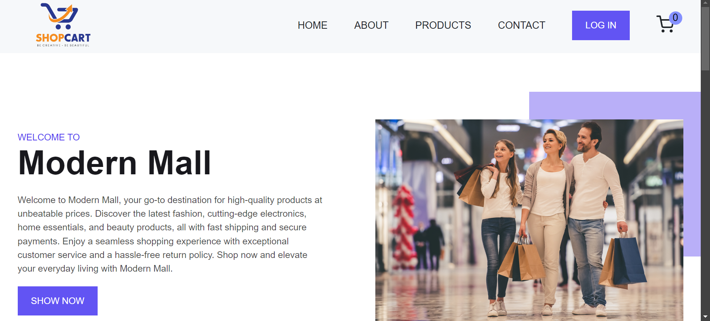

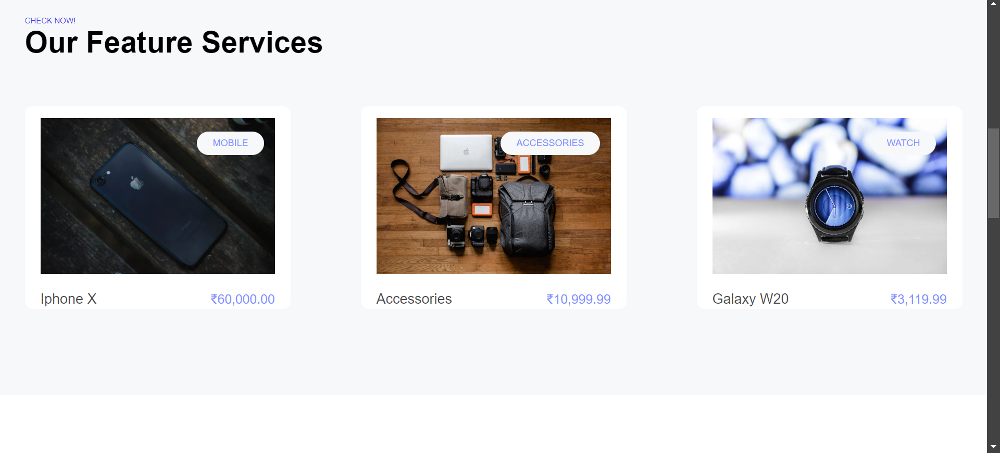

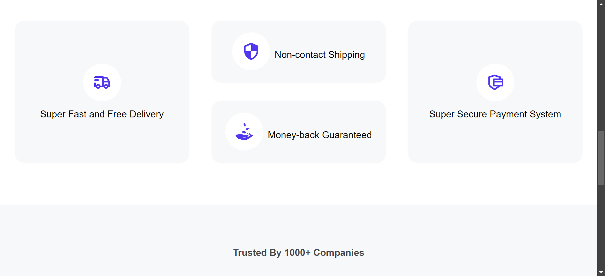

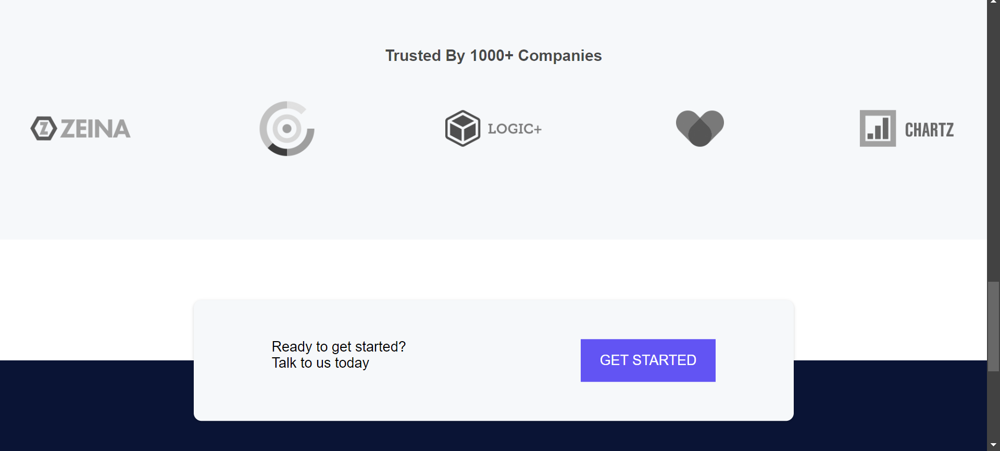

##About Interface

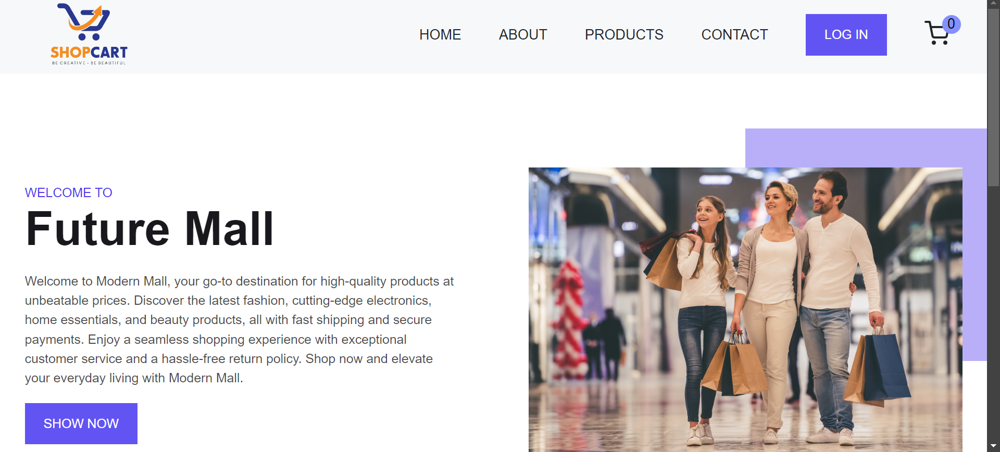

##Products Interface

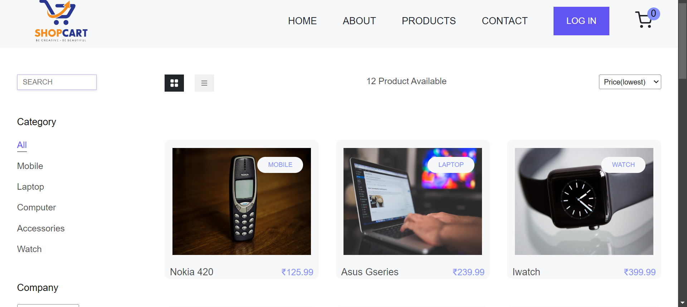

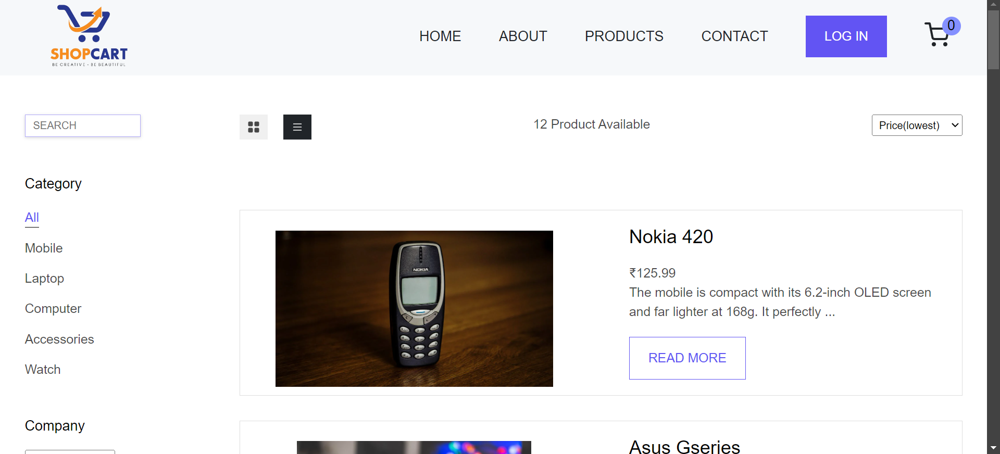

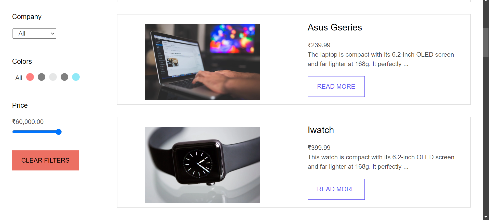

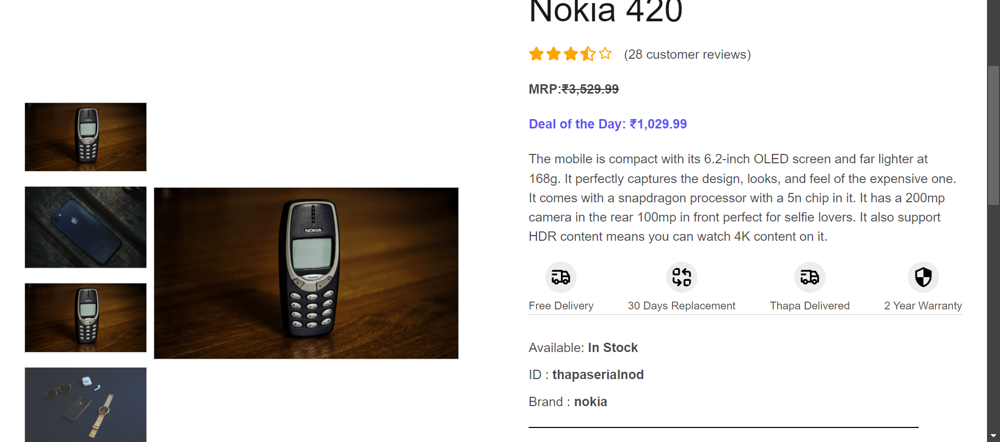

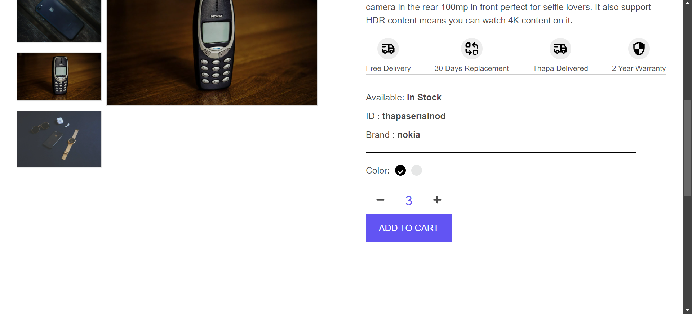

##Contact Interface

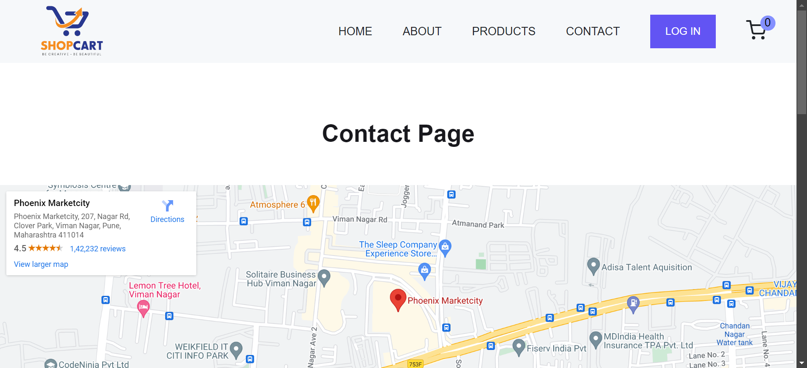

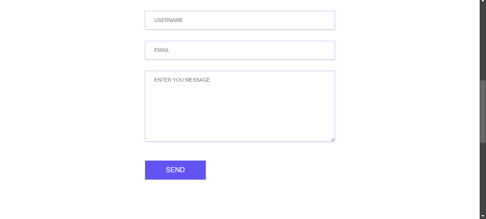

##Cart Interface

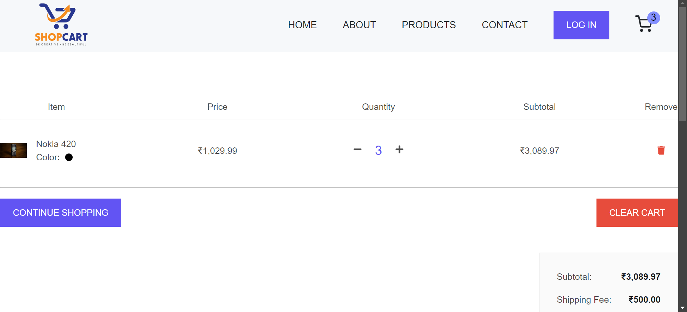

##Login Interface

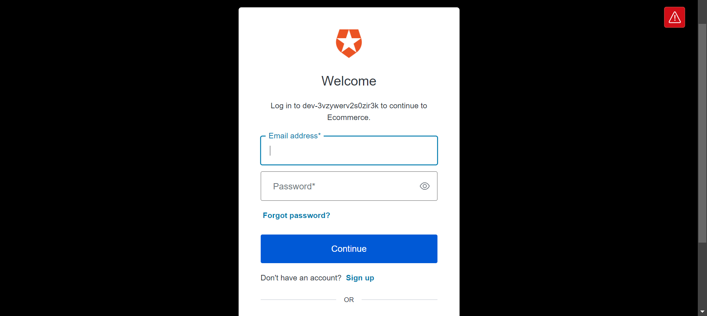

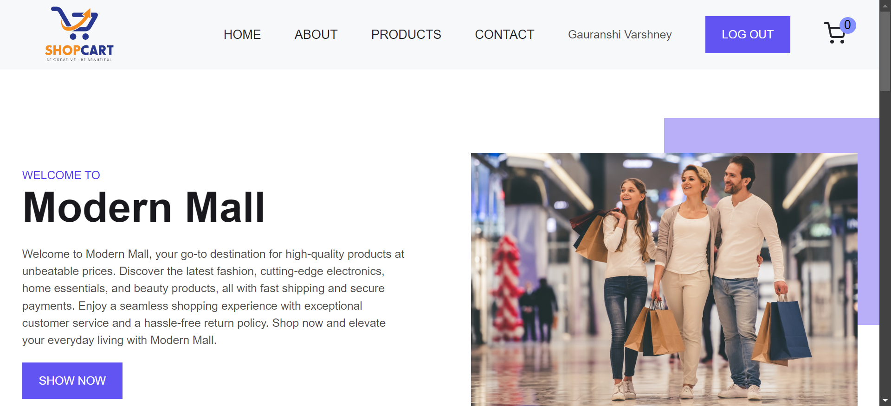

##Footer Interface

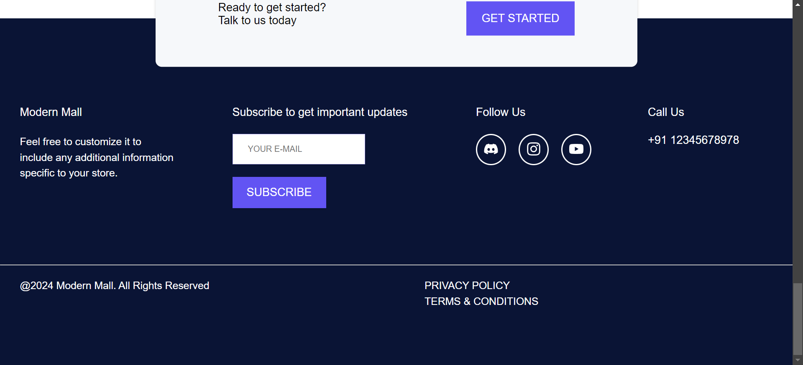

Feel free to customize this template according to your project's specific needs and details!

For any inquiries, please contact:

Name: Gauranshi Varshney
Email: gauranshivarshney@gmail.com
